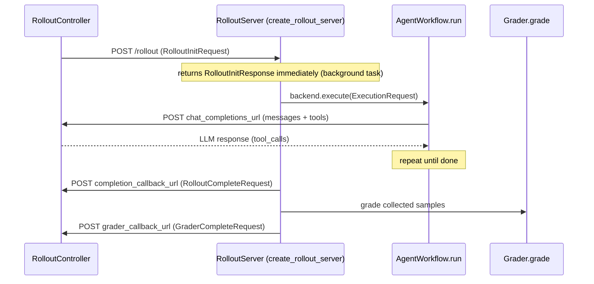

# Architecture

> Code-anchored map of the `osmosis_ai` package for developers. For platform concepts and CLI usage see [docs.osmosis.ai](https://docs.osmosis.ai).

## Package layout

```text
osmosis_ai/
├── cli/               # CLI framework + all command groups (Typer)
│   ├── main.py        # Entry point & command registration (osmosis_ai.cli.main:main)
│   ├── errors.py      # CLIError — the single error type used by every domain
│   ├── console.py     # Console (rich + plain fallback)
│   ├── output/        # Output context, result types, JSON/plain envelopes
│   └── commands/      # Thin Typer shells; delegate to platform/cli + eval
├── platform/          # Everything that talks to the Osmosis Platform API
│   ├── auth/          # Device-code login, credential store, HTTP client
│   ├── api/           # OsmosisClient
│   └── cli/           # Platform CLI business logic (no Typer registration)
├── rollout/           # Remote Rollout SDK (see rollout-sdk.md)
│   ├── agent_workflow.py  # AgentWorkflow ABC
│   ├── grader.py          # Grader ABC
│   ├── context.py         # RolloutContext / AgentWorkflowContext / GraderContext
│   ├── driver.py          # RolloutDriver — eval-facing execution contract
│   ├── validator.py       # Static backend validation
│   ├── server/            # create_rollout_server (FastAPI) + ControllerAuth
│   ├── backend/           # ExecutionBackend ABC + Local / Harbor backends
│   ├── types/             # protocol.py, config.py, sample.py
│   └── integrations/      # Strands / OpenAI Agents adapters
├── eval/              # Eval helpers
│   ├── rubric/        # evaluate_rubric() LLM-as-judge engine
│   └── common/cli.py  # Workflow + grader loader (used by cloud submit preflight)
├── templates/         # `osmosis template` recipe catalog + source resolution
├── __init__.py        # Top-level exports (lazy __getattr__)
├── _litellm_compat.py # LiteLLM import shim (shared by rubric + eval)
└── consts.py          # PACKAGE_VERSION
```

## Domain boundaries

- `cli/` — the CLI framework layer plus every command group. Files in [../osmosis_ai/cli/commands/](../osmosis_ai/cli/commands/) are thin shells that delegate to business logic; see [cli.md](./cli.md).
- `platform/` — anything that calls the Osmosis Platform API. Business-logic helpers (no Typer registration) live in [../osmosis_ai/platform/cli/](../osmosis_ai/platform/cli/).
- `rollout/` — the remote rollout protocol SDK: the `AgentWorkflow` + `Grader` abstraction, execution backends, and the FastAPI server. See [rollout-sdk.md](./rollout-sdk.md).
- `eval/` — `rubric/` powers `osmosis eval rubric` (see [eval.md](./eval.md)); `common/cli.py` exposes the workflow + grader loader that cloud `eval submit` / `train submit` preflight uses.

## Key import paths

```python
from osmosis_ai.cli.errors import CLIError
from osmosis_ai.cli.console import Console
from osmosis_ai.platform.auth import load_credentials
from osmosis_ai.eval.rubric import evaluate_rubric, RubricResult
from osmosis_ai.rollout import AgentWorkflow, Grader, create_rollout_server
```

`osmosis_ai.rollout` is **not** re-exported at the package top level — import it directly.

## Lazy loading

CLI startup must stay fast (~150 ms vs ~1 s), so heavy dependencies load on first use, not at import time:

- **Top-level package** — [../osmosis_ai/__init__.py](../osmosis_ai/__init__.py) resolves rubric exports (`evaluate_rubric`, `RubricResult`, error types) through `__getattr__`. Only `__version__` is eager.
- **Command shells** — every file in [../osmosis_ai/cli/commands/](../osmosis_ai/cli/commands/) uses function-level imports for heavy deps (`rollout.*`, `platform.api.*`, `platform.cli.*`, `eval.*`). Module-level imports stay light: `typer`, `cli.console`, `cli.errors`, the lightweight `platform.constants`, and stdlib.
- **No eager `cli.main`** — [../osmosis_ai/cli/__init__.py](../osmosis_ai/cli/__init__.py) does not import `cli.main`, which prevents circular imports when rollout/server modules import `cli.console`. The entry point is `osmosis_ai.cli.main:main` directly.
- **`_litellm_compat.py`** stays at the package top level because `eval/rubric/` depends on it.

## Remote rollout protocol

The core design separates **LLM inference** (on the training cluster) from **agent logic** (on your RolloutServer). The controller (Traingate/slime) drives inference; your `AgentWorkflow` runs the agent and your `Grader` attaches rewards. Inference weights stay on the training cluster so PPO sees consistent model weights, while agent/tool code can run anywhere.



Anchors:

- Server + endpoints + callbacks: [../osmosis_ai/rollout/server/app.py](../osmosis_ai/rollout/server/app.py) (`create_rollout_server`, `POST /rollout`, `GET /health`, `_handle_rollout`).
- Wire types: [../osmosis_ai/rollout/types/protocol.py](../osmosis_ai/rollout/types/protocol.py) (`RolloutInitRequest`, `RolloutCompleteRequest`, `GraderCompleteRequest`, `GraderStatus`).
- Execution contract: [../osmosis_ai/rollout/backend/base.py](../osmosis_ai/rollout/backend/base.py) — `ExecutionBackend.execute(request, on_workflow_complete, on_grader_complete)`, where the two callbacks are `ResultCallback` parameters (not methods).
- Sample/result types: [../osmosis_ai/rollout/types/sample.py](../osmosis_ai/rollout/types/sample.py) (`RolloutSample`, `RolloutStatus`, `RolloutErrorCategory`, `ExecutionRequest`, `ExecutionResult`).

The controller delivers results asynchronously via the two callback URLs, so it can manage many concurrent rollouts. `grader_callback_url` is optional; when omitted, grading is skipped.

### Eval path

For local evaluation the same workflow/grader run behind a different driver. The eval-facing contract is `RolloutDriver` / `RolloutOutcome` in [../osmosis_ai/rollout/driver.py](../osmosis_ai/rollout/driver.py): eval supplies data + an LLM endpoint and consumes trace + reward, without caring whether execution was in-process or over HTTP.

## Static validation

During cloud `eval submit` / `train submit` **preflight**, `validate_rollout_backend` ([../osmosis_ai/platform/cli/workspace_directory_contract.py](../osmosis_ai/platform/cli/workspace_directory_contract.py)) calls `validate_backend` ([../osmosis_ai/rollout/validator.py](../osmosis_ai/rollout/validator.py)), which checks the workflow/grader classes the way `LocalBackend` instantiates them: concrete subclasses of `AgentWorkflow` / `Grader`, `async` `run` / `grade`, a resolvable agent name (1–256 chars), and successful instantiation with the provided config. It aggregates every applicable error into one `ValidationResult` instead of stopping at the first failure. (There is no separate "serve" step — see [rollout-sdk.md](./rollout-sdk.md).)

## See also

- [rollout-sdk.md](./rollout-sdk.md) — the library API surface
- [cli.md](./cli.md) — CLI internals
- [CONTRIBUTING.md](../CONTRIBUTING.md) — dev workflow
